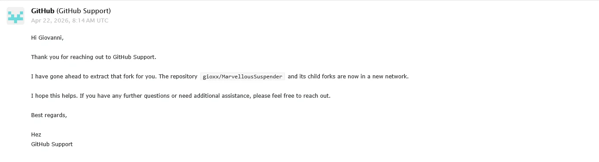

[The Marvellous Suspender](https://github.com/gioxx/MarvellousSuspender) has been a fork since day one, [born in 2021](https://gioxx.org/2021/01/18/the-marvellous-suspender-per-google-chrome/) out of The Great Suspender, at a time when that project had been pulled from the Chrome Web Store and flagged as malware. TMS cleaned up what needed cleaning and gave orphaned users somewhere to go. Fair enough, that's exactly what a fork is for.

But five years later, TMS isn't a patched-up copy of someone else's abandoned code anymore. It's had a full Manifest V3 rewrite, a proper visual redesign, its own contributors, and, as of a few months ago, a home under the [Marvellous Codeworks](https://marvellouscode.works) name. The GitHub fork relationship, though, hadn't changed: technically, `gioxx/MarvellousSuspender` was still listed as a fork of the original repository, tied to its network, its issues, its history.

{/* truncate */}

## Asking GitHub to cut the thread

So I asked GitHub Support to detach it, a "Detach/Extract Fork" request, which pulls a repository (and its own child forks) out of the network it was born in and gives it a clean, independent history on GitHub's side. No more fork badge, no more shared network with the original project.

GitHub got back to me quickly:

> I have gone ahead to extract that fork for you. The repository `gioxx/MarvellousSuspender` and its child forks are now in a new network.

Done. As of today, TMS no longer carries GitHub's official "forked from" label.

## Why it matters

This isn't a cosmetic change, and it isn't really about the label either. It's the first concrete, official move to stop treating TMS as an offshoot of something else and start treating it as what it actually is: a project with its own direction, maintained by Marvellous Codeworks.

It also isn't the last step. Right now `gioxx/MarvellousSuspender` still lives under my personal GitHub account. The plan is to move it, along with the rest of what makes up TMS, under the [Marvellous Codeworks organization](https://github.com/Marvellous-Codeworks) on GitHub, where other projects already live. We're aiming to get that done by the end of summer 2026.

Small steps, but each one makes it a little more true: TMS's future isn't tied to what it was forked from anymore. It's Marvellous Codeworks now.
