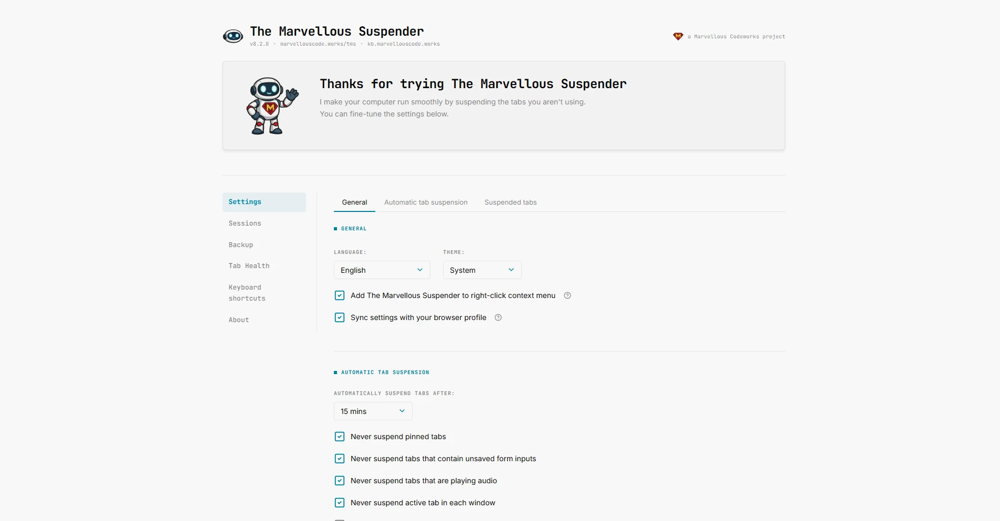
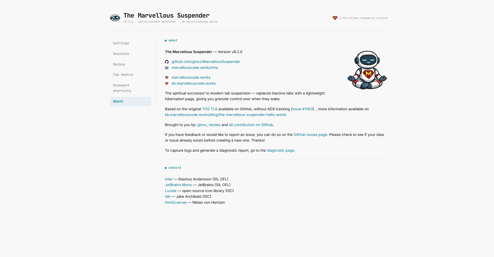
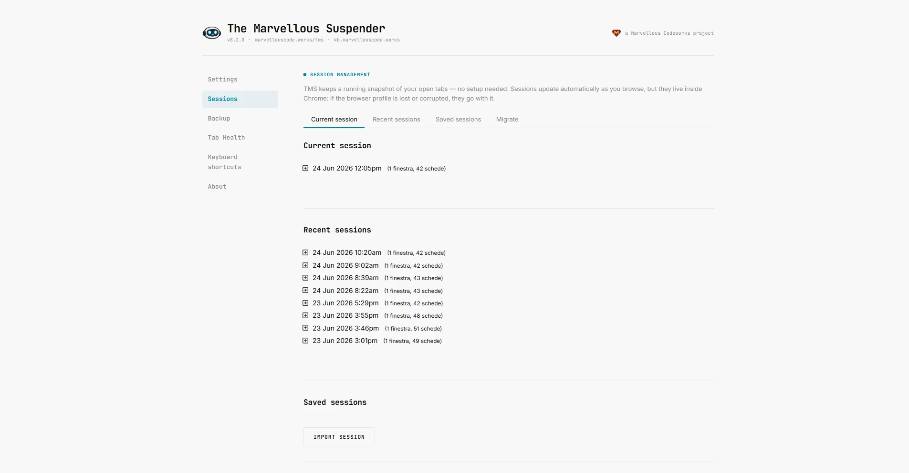
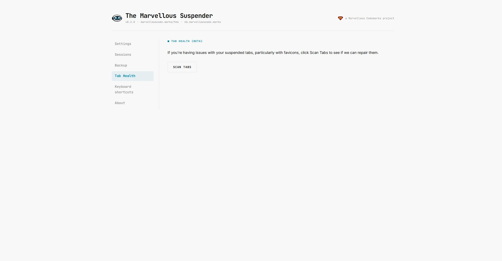
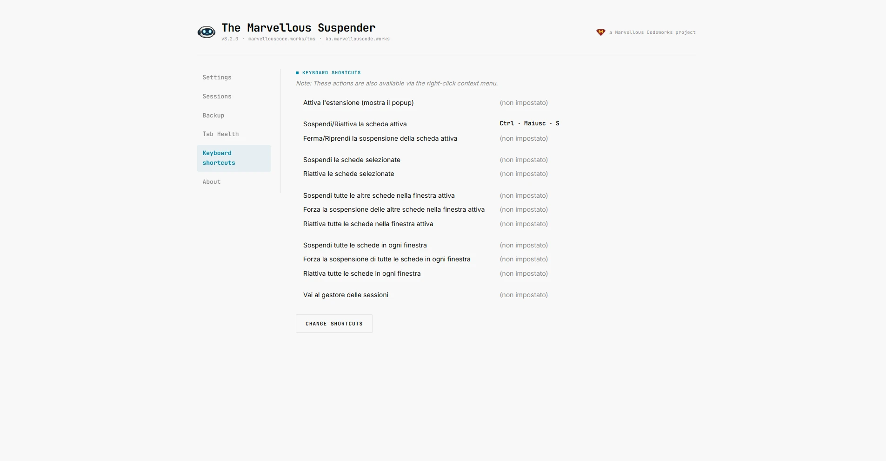

TMS has been quietly getting better for years — new bugfixes, compatibility patches, a full Manifest V3 migration — but the extension's visual identity never kept up. The settings pages still looked like a relic of 2018. The popup was fine, but only barely. Nothing matched the [Marvellous Codeworks website](https://marvellouscode.works).

That changes with TMS 9.

This is the first in a series of posts we're calling **Road to TMS 9** — a chance to show you what's being built on the feature branches before it ships, explain the decisions behind the changes, and hear from you before things are set in stone. Think of it as development in the open.

Today: the visual redesign.

{/* truncate */}

## A design system from scratch

The most important change in TMS 9's interface is one you won't immediately see: a proper **design token system**.

Rather than scattering raw hex values and `px` literals across a dozen CSS files (which is exactly how TMS looked until now), we wrote [`tokens.css`](https://github.com/gioxx/MarvellousSuspender/blob/feature/visual-redesign/src/css/tokens.css) — a single source of truth for every color, spacing step, type size, shadow, and animation duration in the extension. Every other stylesheet consumes these tokens. Change one token, the entire UI shifts consistently.

The color palette is built around **OKLCH** — a perceptually uniform color space that produces more predictable results across light and dark modes than the old `rgb()` / `hex` approach. The primary accent color is now the same cyan-blue used on marvellouscode.works, carrying the mascot's signature eye-glow right into the UI.

Light and dark mode are properly supported for the first time. The previous implementation layered hardcoded hex overrides inside `body.dark { … }` blocks — functional, but brittle. The token system drives both modes from the same cascade, and `prefers-color-scheme` is respected automatically. If you never touch the theme selector, the extension follows your OS.

One small but meaningful detail: `@media (prefers-reduced-motion: reduce)` sets all animation duration tokens to `0ms`. If you've told your OS you want less motion, TMS will honor that.

## New fonts

TMS 9 ships two self-hosted variable fonts:

- **[Inter](https://rsms.me/inter/)** — the sans-serif workhorse for all body copy, labels, and form elements. No more system font lottery.
- **[JetBrains Mono](https://www.jetbrains.com/lego/fonts/jetbrains-mono/)** — the monospace font used for version numbers, code-style strings, and button text. If you've used JetBrains IDEs or VS Code with this font, it'll feel right at home.

Both are loaded via `@font-face` with `font-display: swap`, so they don't block rendering. Both ship under the SIL Open Font License — along with [Lucide](https://lucide.dev/), which replaces the old custom icon font.

## Unified page identity

Every settings page in TMS — Options, About, Health, Shortcuts, Sessions — now opens with the same brand header: Suspendy Guy on the left, the extension name in monospace bold, the Marvellous Codeworks logo anchored to the right. Sidebar navigation is now a proper `<nav>` element. Each content area gets an eyebrow label that anchors it visually before the content starts.

It sounds like a small thing. In practice it makes the extension feel like a coherent product rather than five loosely-related pages that happened to ship together.

Even the bare pages — Tab Health is a good example — got the full treatment. Same header, same sidebar, same typography system, even when there's almost nothing on the page yet.

The popup received the same treatment — a new brand bar at the top shows the mascot icon, the extension name, and the current version number. You always know what version you're running without opening the About page.

## New features already on the branch

The redesign commit wasn't just cosmetic. Two features worth knowing about landed alongside it.

**Language override.** TMS has always followed the browser's locale — if Chrome is set to Italian, TMS speaks Italian. TMS 9 adds a dropdown in General settings that lets you force a specific language regardless of what the browser reports. Useful if your browser is set to English but you'd rather read the extension in Italian (or vice versa). Implemented by [fetching the chosen locale's `messages.json` at page load](https://github.com/gioxx/MarvellousSuspender/commit/b67f887) and using it in place of Chrome's `i18n.getMessage()`.

**Tab strip context menu** _(pending Chrome stable rollout)_. Chrome is adding support for `"tab"` as a context type in extension context menus — meaning TMS will be able to add entries to the right-click menu on the tab bar itself, not just on page content. The implementation is already live on the branch: Suspend/Unsuspend, Pause/Unpause, Never suspend domain, Never suspend URL, and the window/all-window variants. The Keyboard Shortcuts page already surfaces the note:

The catch is that Chrome hasn't shipped the tab strip UI yet (confirmed up to Chrome 149 at the time of writing). When it lands in stable, TMS 9 will support it automatically — no update needed on your end.

## Under the hood

The visual branch also includes some housekeeping that users won't see but that keeps the codebase healthy:

- All PNG images (except toolbar icons, which Chrome requires as PNG) have been converted to WebP — saving up to 77% in bundle size on some assets.
- The old custom Fontello icon font (6 glyphs, woff/woff2) has been replaced by a minimal [Lucide](https://lucide.dev/) SVG sprite, which is easier to maintain and extend.
- The Italian locale received a thorough overhaul: ~45 strings that were still in English have been translated, and several grammatical issues have been fixed.

The two main commits covering all of this are [`1260f94`](https://github.com/gioxx/MarvellousSuspender/commit/1260f94) and [`b67f887`](https://github.com/gioxx/MarvellousSuspender/commit/b67f887) on the [`feature/visual-redesign`](https://github.com/gioxx/MarvellousSuspender/tree/feature/visual-redesign) branch, which is public if you want to follow along or try it yourself.

## Next in the series

The visual redesign is one piece of the TMS 9 puzzle. The next post covers something that might seem less exciting but is arguably more important: **replacing the extension's aging third-party libraries** — one abandoned since 2021, one stuck on a 2020 release candidate. We'll also have a question for the community about a feature that may or may not survive into TMS 9.

If you have thoughts on the redesign — what you like, what doesn't work, what you'd change — [open a discussion on GitHub](https://github.com/gioxx/MarvellousSuspender/discussions).

:::warning
The `feature/visual-redesign` branch is development code, not a release build. **Do not install it as a side-loaded extension.** The branch deliberately shares the same extension ID as the Chrome Web Store version, which means loading it locally would overwrite your production installation and could corrupt your sessions and settings. The screenshots in this post are all you need — sit tight and wait for the official release.
:::
