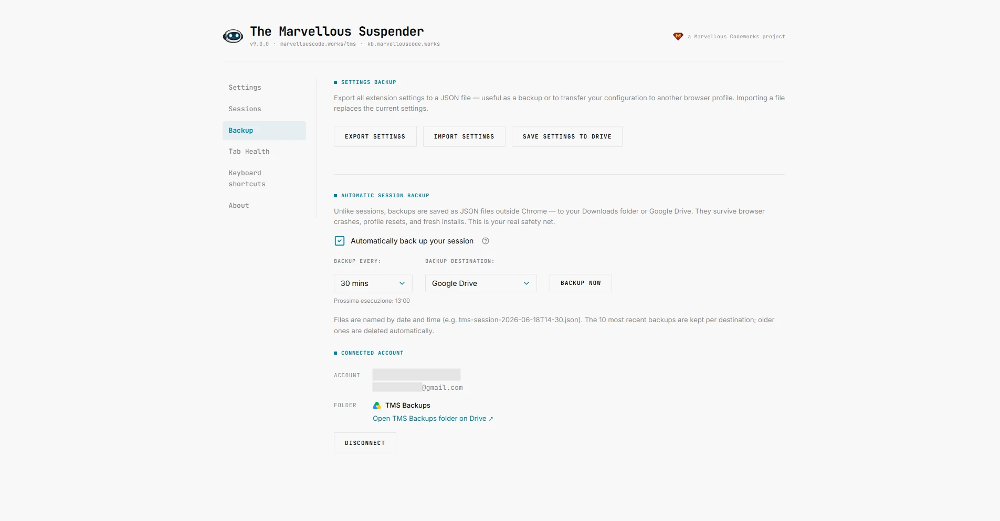
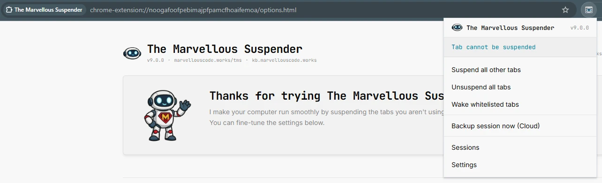

If there is one thing TMS users have asked for more than anything else over the years, it is this: *please don't let me lose my sessions*. A browser profile wipe, a clean OS install, an accidental extension removal — and everything is gone. TMS has always saved sessions inside Chrome's storage, but Chrome's storage lives and dies with the browser profile.

The `feature/session-backup` branch changes that.

{/* truncate */}

## Automatic session backup

The headline feature is a new background module — `gsBackup.js` — that silently saves your current session as a JSON file on a schedule you control. No dialog, no confirmation prompt, no interruption. It just runs.

You configure it from the new dedicated **Backup page** (more on that below):

- **Interval**: 15 minutes, 30 minutes, 1 h, 2 h, 4 h, 8 h, or once a day at a specific time you choose.
- **Destination**: your local Downloads folder (inside a `tms-backups/` subfolder) or your Google Drive.
- TMS retains the **10 most recent backups** and automatically deletes older ones. No manual cleanup needed.

One detail worth calling out: backup alarms are now anchored to real clock time, not to browser startup. If you set a 15-minute interval, backups always fire at :00, :15, :30, :45 — regardless of when you started Chrome. The daily option lets you pick a specific time of day; it will fire at that time every day, even if you restart the browser in between.

A **"Backup now"** button is also available directly in the popup when backup is enabled — so you can trigger an immediate save without opening the Backup page.

## Google Drive integration

When you choose Drive as your destination, TMS authenticates silently via Chrome's `identity` API (OAuth 2.0, `drive.file` scope — access limited to files TMS itself creates) and uploads each backup to a visible **"TMS Backups"** folder in your Drive. Cleanup of old Drive backups (keeping the 10 most recent) is handled automatically, just like local backups.

If a scheduled backup fires while no Google account is connected — or if the token expires — TMS shows a **red badge** on the extension icon and a banner in the popup the next time you open it, so you notice the problem before you actually need a backup.

## A dedicated Backup page

Previously, backup settings were buried at the bottom of the Options page. In TMS 9 they get their own first-class page, accessible directly from the sidebar on every settings screen.

The Backup page has two clear sections:

- **Settings backup** — export your extension settings to `tms-settings.json`, or import a previously saved file to restore them. The file is always overwritten on export — settings are not versioned, they are a single point-in-time snapshot. Useful after a reinstall, a machine migration, or just as a safety net before experimenting with settings. When Drive is connected, a "Save settings to Drive" button also appears here, uploading the same file to your TMS Backups folder.
- **Automatic session backup** — the interval, destination, and Drive account controls described above.

## Wake whitelisted tabs

A smaller but handy addition: a new **"Wake whitelisted tabs"** action finds every suspended tab whose original URL matches your whitelist and unsuspends them all in one shot. It appears in the popup (below "Unsuspend all tabs") and next to the "Test whitelist" link in Options. If you regularly whitelist certain domains but sometimes find them suspended after a restart, this is the button you've been waiting for.

## Diagnostic page overhaul

This one is more for power users and anyone who has ever had to file a bug report.

TMS's old debug page was effectively read-only and required DevTools access to extract anything useful. The redesigned **Diagnostic page** has a proper log viewer (colour-coded by level), a persistent log buffer that survives Service Worker restarts, and three action buttons: **Refresh**, **Clear log**, and **Copy/Download report**.

The downloadable report bundles the extension version, browser user-agent, a tab profiler snapshot, and the full log buffer into a single shareable text file. If you encounter a bug and open an issue on GitHub, this report gives us everything we need to diagnose it — no DevTools required on your end.

The "Capture verbose logs" toggle now persists to storage and wakes the Service Worker immediately when changed, so you don't need to restart Chrome to start capturing.

## Bug fixes in this branch

Three fixes that ship alongside the new features:

**Grouped suspended tabs lost after Chrome restart.** Chrome 149 introduced a bug (`crbug.com/522338670`) where tabs inside tab groups with non-`https://` URLs — including TMS suspended tabs — could be navigated to `chrome://newtab/` instead of being restored. TMS 8.1.4 already included a partial fix; this branch extends it: if the reinitialisation check detects that a suspended tab in a group has been navigated away, TMS creates a fresh tab with the correct suspended URL, places it back in the same group, and removes the broken one. No more "press Back to recover" workaround.

**Extension's own pages treated as regular tabs.** TMS's internal pages (`options.html`, `about.html`, `debug.html`, etc.) were not matched by the `isBrowserInternalURL` check — which tested for `chrome:` but not `chrome-extension://` — so they could end up in the suspension queue and generate repeated failed content-script injection attempts. A dedicated `startsWith('chrome-extension://')` guard now catches them before any of that happens.

**Tab profiler showing "unknown" for whitelisted, pinned, and audible tabs.** The profiler was short-circuiting when the content script did not respond and leaving the status as `unknown` instead of falling through to the correct status calculation. Whitelisted, pinned, audible, and active tabs now show their correct labels.

## What's next

The `feature/session-backup` branch is the last major piece of TMS 9. The branch is public at [`feature/session-backup`](https://github.com/gioxx/MarvellousSuspender/tree/feature/session-backup) if you want to follow along with the commits — but read the warning below before you do anything else with it.

:::warning
The `feature/session-backup` branch is development code. **Do not install it as a side-loaded extension.** It shares the same extension ID as the Chrome Web Store version — loading it locally would overwrite your production installation and could corrupt your sessions and settings. Wait for the official release.
:::
