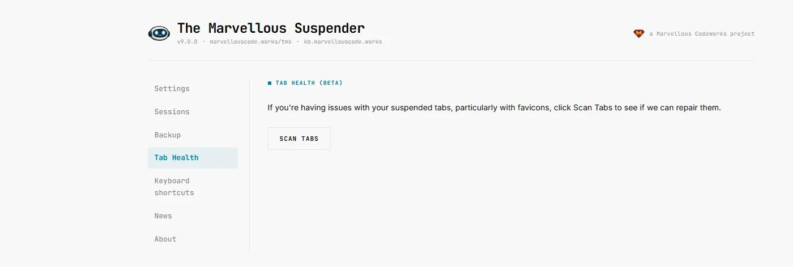
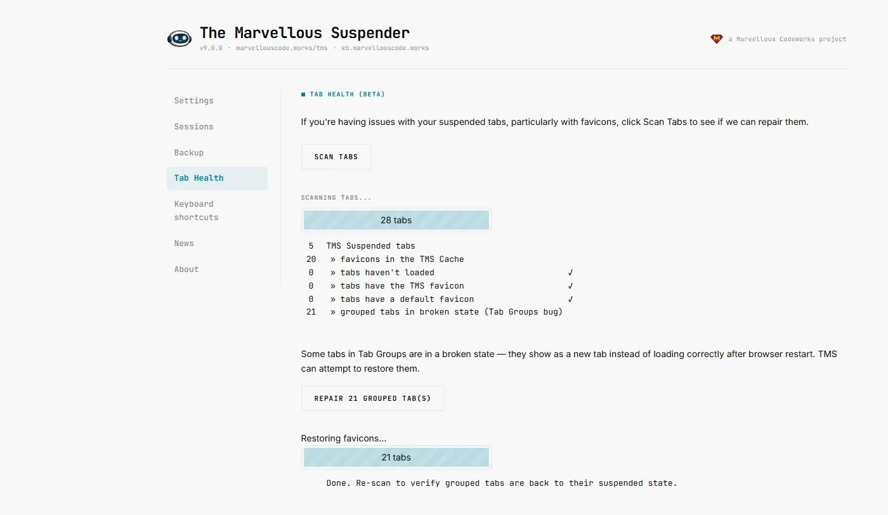

We spent the last few posts chasing a Chromium regression across three browsers: it [broke grouped tabs on Chrome 149](/blog/tms-tab-groups-chrome-149-bug), [reached Edge](/blog/tms-tab-groups-edge-chromium-bug) shortly after, and was finally [fixed upstream in Chrome 150](/blog/tms-tab-groups-chrome-150-fixed). That last post also introduced the plan for **Brave**, which does not follow Chrome's release schedule and might stay affected for a while: TMS 9's new Tab Health page can detect and repair the broken tabs on demand, without waiting for Brave to catch up.

This week we actually ran that repair on a Brave profile with tab groups in a broken state, and it is worth showing rather than just describing.

{/* truncate */}

## Scan Tabs

The Tab Health page opens with a single button. Nothing happens until you ask for it.

## What the scan found

Clicking **Scan Tabs** walks through every tab and reports back. On this Brave profile, out of 28 tabs, TMS found 5 suspended tabs, 20 cached favicons — and **21 grouped tabs in a broken state**, flagged specifically as the Tab Groups bug.

That number is the point of this post. On Brave, those 21 tabs would otherwise sit there as blank `chrome://newtab/` pages until someone clicked the browser Back button on each one, one at a time. Instead, a **Repair 21 grouped tab(s)** button appears right below the scan results.

One click later: "Restoring favicons... 21 tabs. Done. Re-scan to verify grouped tabs are back to their suspended state." All 21 tabs recovered in a single pass, matched back to their original suspended URLs by window order and tab index — the Brave-specific recovery path described in the [Chrome 150 post](/blog/tms-tab-groups-chrome-150-fixed#for-brave-and-edge-users).

## Why this matters for Brave users specifically

Chrome shipped the real fix in version 150. Whether and when Brave aligns with it is out of our hands — Brave tracks upstream Chromium on its own schedule, and there is no guarantee it lands quickly. If it does, this repair simply becomes unnecessary, the same way it already is for Chrome 150 users.

If it does not, TMS 9 gives Brave users a real answer instead of a manual workaround: open the Tab Health page, click Scan Tabs, and if it finds broken grouped tabs, click Repair. No side-loaded companion extension, no clicking Back on every tab, no waiting on a browser vendor's release notes.

:::warning
TMS 9 is still in development. The screenshots in this post come from a build running on the `feature/session-backup` branch, not a public release. **Do not side-load TMS 9 branches yourself** — they share the same extension ID as the Chrome Web Store version, and doing so would overwrite your production installation. Wait for the official release.
:::
