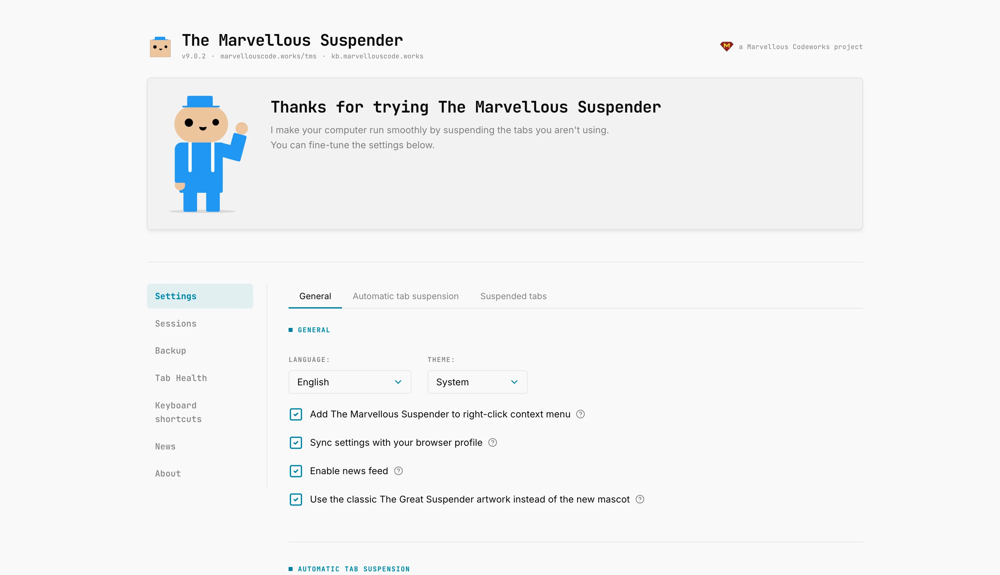

The new mascot and icon set that shipped with TMS 9 has not landed well with everyone, [some of the feedback on 9.0.2 made that clear](/blog/tms-release-9-0-2#the-generative-image-backlash). While that discussion continues, 9.0.2 also ships a direct, no-strings-attached answer for anyone who just wants the old look back: a checkbox.

{/* truncate */}

## Use the classic The Great Suspender artwork

A new option in **Options → General**, "Use the classic The Great Suspender artwork instead of the new mascot", switches TMS's icons and illustrations back to the original The Great Suspender style, the artwork the project was originally built on, wherever a legacy version of the image exists.

It is applied consistently, not just in one corner of the UI: the toolbar icon, the suspended-tab page's favicon fallback, and every extension page's own images and favicon all switch together, resolved through a single mapping so there is no mix-and-match between old and new art on different screens. A couple of illustrations that never existed in the original set (used for less common states) have no legacy equivalent, those keep using the new artwork regardless of the toggle.

Off by default, on-demand, reversible any time. No data migration, no restart required.

Full reference in the [Settings docs](/docs/TMS/pages/settings#use-the-classic-the-great-suspender-artwork).
