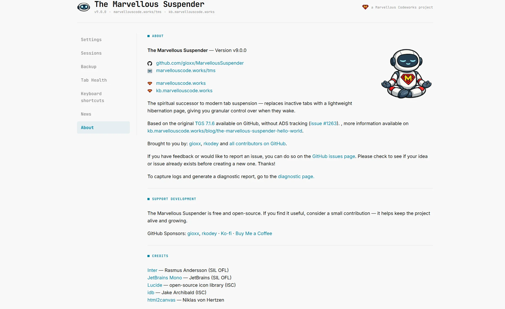
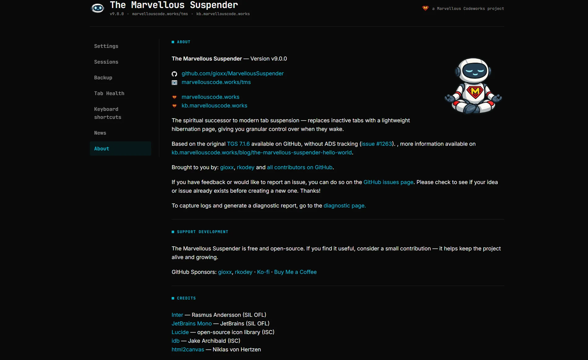

# About & Support

Open the About page from the left sidebar (**Support**). Available in Incognito windows too.

It's TMS's "who made this" page: version number, links to [GitHub](https://github.com/gioxx/MarvellousSuspender) and [marvellouscode.works/tms](https://marvellouscode.works/tms), the fork's origin story (see [What happened to The Great Suspender?](../faq#what-happened-to-the-great-suspender)), contributors, a link to [GitHub Issues](https://github.com/gioxx/MarvellousSuspender/issues) and the [Diagnostic page](./diagnostic-page) for bug reports, ways to support the project (GitHub Sponsors, Ko-fi, Buy Me a Coffee — entirely optional), and credits for third-party assets (Inter/JetBrains Mono fonts, Lucide icons, `idb`, `html2canvas`).

*Dark theme:*

