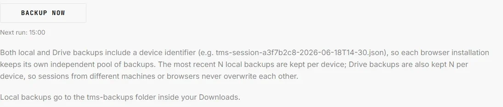
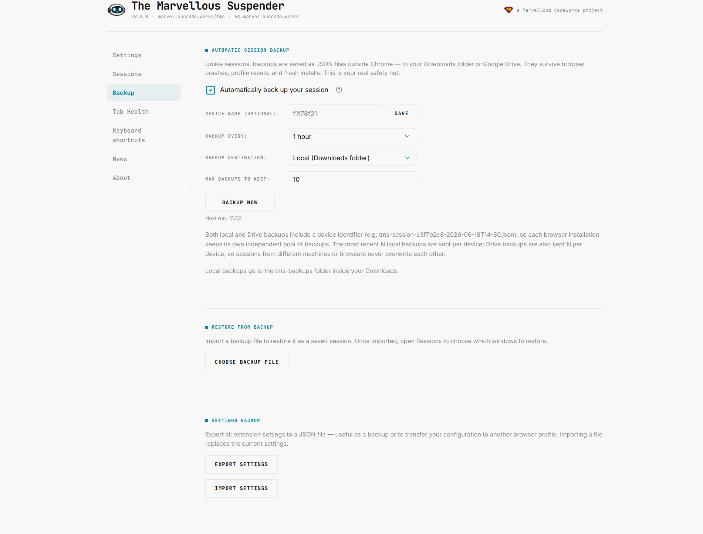
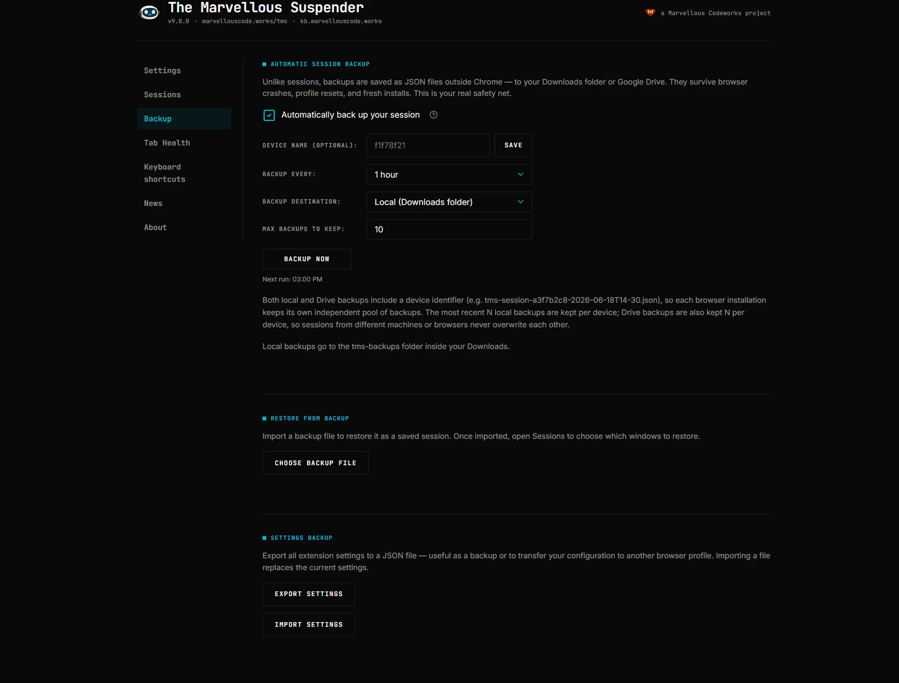
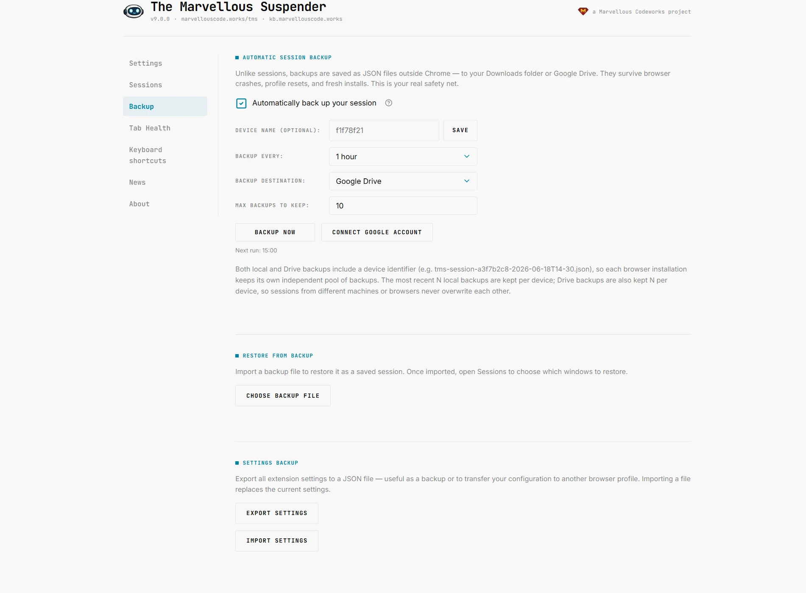
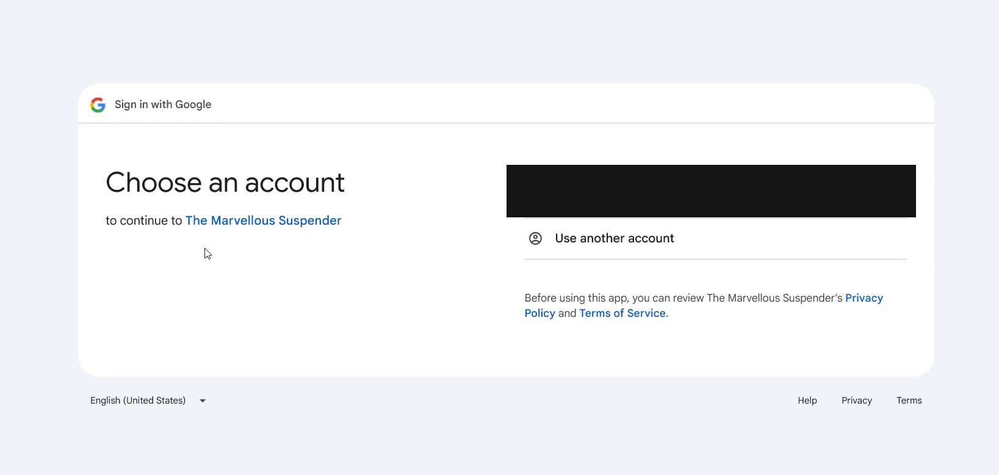
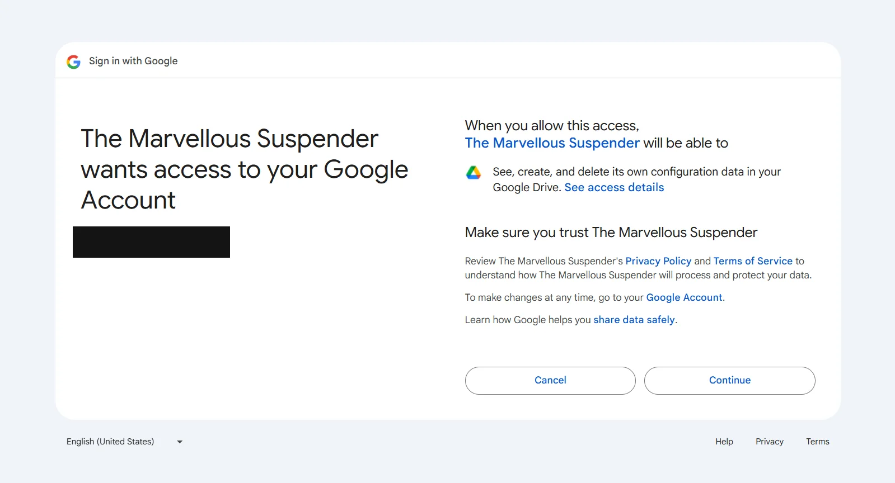
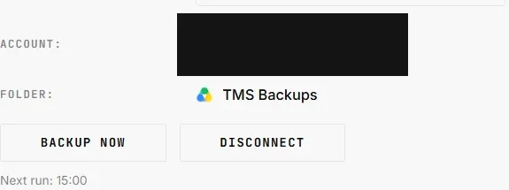
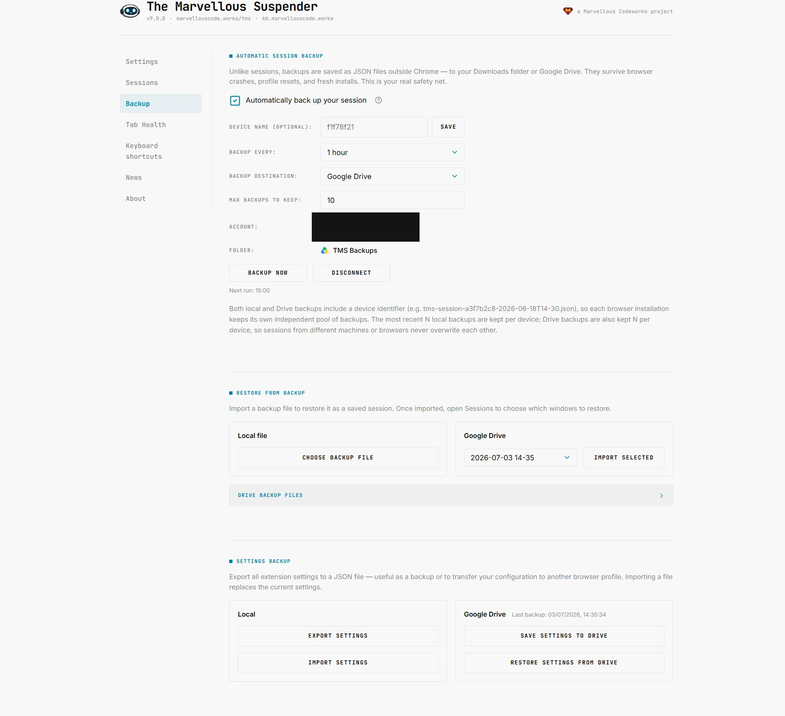
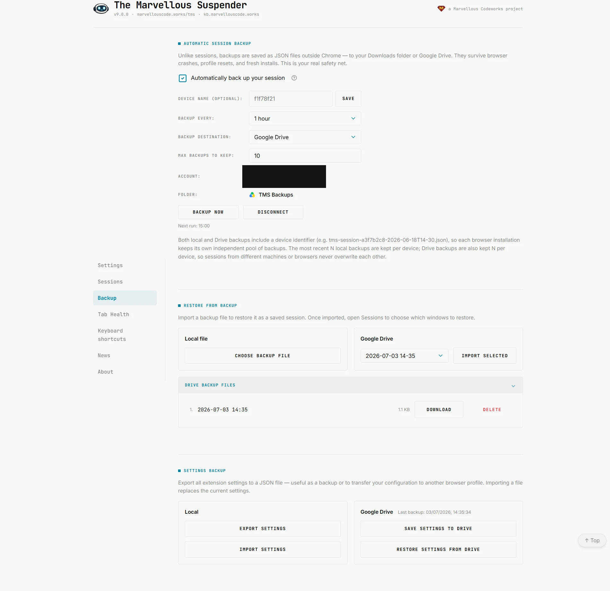
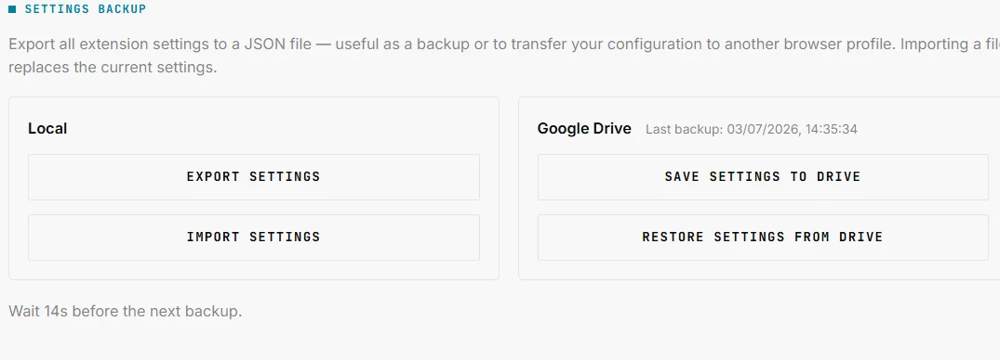

# Backup & Sync

Open the Backup page from the extension popup or from **Backup** in the left sidebar (shown on every extension page). Not available in Incognito windows.

This page covers three independent features: **automatic session backup**, **restoring a session from a backup file**, and **backing up/restoring your TMS settings**. All three are optional, TMS works fully without ever touching this page, since it also keeps its own [session history](./session-management) locally.

---

## Automatic session backup

### What gets backed up
On each run, TMS backs up your **current session**: every open window, its tabs (original URLs, not the internal suspended-page URL) and Chrome Tab Group assignments, the same data you'd get from an [Export](./session-management#export) in Session Management, just automated and written to a file.

### Enable automatic backup

*Since 9.0.1, this page shows a note reminding you that backup is off, with an option to snooze the reminder for 10 days or dismiss it permanently, see [Backup activation nudge](#backup-activation-nudge) below.*

Toggle **Enable automatic backup**. Since **9.0.1**, doing so triggers Chrome's permission prompt for `downloads` right at that moment, not before, see [Permissions](../permissions#what-changed-in-9x) for why. If you decline the prompt, the toggle reverts and nothing is enabled. Once enabled (and the permission granted), four settings become available:

| Setting | Description |
|---|---|
| **Device name** *(optional)* | A friendly label for this installation, e.g. "MacBook" or "Work PC". Shown as the group heading when restoring backups from a machine with more than one device. If left empty, the device's internal ID is used instead. |
| **Backup interval** | How often TMS runs a backup: every 15 minutes, 30 minutes, 1, 2, 4, 8 hours, or once a day at a chosen time. |
| **Backup destination** | **Local** (saved to your Downloads folder) or **Google Drive** (see below). |
| **Max backups per device** | How many backup files to keep before older ones are automatically deleted. Default 10, configurable from 2 to 50. |

Click **Backup now** at any time to run a backup immediately, independent of the schedule. To prevent accidental spam, the button (and the "Save settings to Drive" button) is disabled for 30 seconds after each run, a countdown in the status bar shows when it re-enables.

If a backup produces an empty result (no open windows/tabs to save), TMS silently skips it, no empty backup files are created.

*Dark theme:*

### Backup activation nudge

*Added in 9.0.1.* If you've never turned on automatic backup, TMS shows a quiet reminder rather than nagging you with repeated pop-ups:

- A small amber badge on the toolbar icon.
- A banner in the extension popup, clicking it opens this page.
- The note shown above, on this page.

Each surface offers **Remind me in 10 days**, which snoozes the reminder (badge, popup banner, and this note all reappear automatically once the snooze expires), or, from this page only, a permanent **I'm not interested, stop reminding me** checkbox. Once you enable automatic backup, or check that box, all three surfaces stay hidden until the corresponding condition changes again. Nothing about this reminder collects data or phones home, it only reads your own local `Enable automatic backup` setting.

### Local backups
Files are written to `Downloads/tms-backups/tms-session-{deviceId}-{timestamp}.json`. The `{deviceId}` is a random 8-character identifier generated once per browser installation and stored locally, it exists purely so that two browsers writing to the same Downloads folder (e.g. Chrome and Brave on the same machine) never overwrite each other's files. Rotation keeps only the newest **Max backups per device** files for *this* installation.

#### Save dialog popping up on every backup
TMS saves local backups via `chrome.downloads.download()` with `saveAs: false`, which normally writes the file silently with no prompt. If Chrome's own setting **"Ask where to save each file before downloading"** (`chrome://settings/downloads`) is turned on, Chrome overrides that and shows its save-location dialog anyway, for every download, TMS included. This is Chrome's behavior, not something an extension can suppress or opt out of.

If scheduled backups are popping up a save window and stealing focus, turn that Chrome setting off (and set a default download folder) so backups save silently, or switch **Backup destination** to Google Drive, which doesn't go through the downloads dialog at all.

### Google Drive
Switching **Backup destination** to Google Drive before connecting an account shows a **Connect Google Account** prompt in place of the backup/disconnect buttons:

Click **Connect**. Since **9.0.1**, this first triggers Chrome's permission prompt for `identity`, requested at this point rather than upfront, before continuing into the standard Google OAuth consent flow: choose the account, then confirm access:

TMS requests only the narrow `drive.appdata` scope, see [Permissions](../permissions#what-changed-in-9x) for what that does and does not allow. Once connected you'll see the connected account and the destination folder shown on the page:

Backups on Drive live in a hidden, app-only folder (`appDataFolder`) that never appears in your regular Google Drive file list, this is also why there is no "open in Drive" link for it. Filenames follow the same `tms-session-{deviceId}-{timestamp}.json` pattern as local backups.

#### Multi-device rotation
If you use TMS on more than one machine with the same Google account, each device's backups are rotated **independently**, a lightweight session synced from a laptop with three tabs open will never push out backups from your primary desktop's 40-tab session. This works via a small per-device registry file (`tms-device-{deviceId}.json`) that TMS keeps up to date with the device's friendly name and the time it last backed up.

#### Disconnecting
The **Disconnect** button revokes the OAuth token (`chrome.identity.removeCachedAuthToken` + a call to Google's token-revocation endpoint). Existing backup files on Drive are **not** deleted, only the connection from this browser is removed.

#### If Drive authentication fails
If a scheduled Drive backup fails because the connection expired or was revoked elsewhere, TMS shows a small red badge on the toolbar icon and a banner in the popup. Clicking the banner opens this page so you can reconnect.

#### Connecting on Brave or Vivaldi
*Fixed in 9.0.2.* Chrome's `chrome.identity.getAuthToken()` doesn't work on either browser: Brave attaches a custom URI scheme Google's backend rejects outright (a raw `Error 400: invalid_request` page), and Vivaldi disables Google sign-in entirely, so the connect flow used to hang with no feedback. TMS now falls back to `chrome.identity.launchWebAuthFlow()` on these browsers, racing the original method against a timeout so a Vivaldi-style hang surfaces as a failure instead of hanging forever, and remembers which method worked per install so later connections skip straight to it. Once connected, this page shows a quiet second line under the "TMS Backups" folder name naming which OAuth method is active for the install, mainly useful for support.

#### Why a local file can still appear with Drive selected
On browser shutdown, TMS writes an emergency local backup first regardless of your chosen destination, a Drive upload isn't reliable in that narrow shutdown window since the service worker can be killed mid-request. If your destination is Drive, that local file is queued and uploaded on the next startup, then automatically removed once the upload succeeds. Seeing a file appear locally even in Drive-only mode is expected behavior, not a bug, this is now explained directly on the page too, right below the multi-device rotation note.

### Switching destination from Drive to Local
If you switch the destination from **Google Drive** to **Local**, a dialog offers to import your most recent Drive backup directly into [Saved sessions](./session-management#saved-sessions), a safety net so you don't lose access to that data just because you stopped using Drive. If Drive was never connected, or has no backups, this dialog is skipped.

---

## Restore from backup

A separate section below the backup settings, independent of whether automatic backup is currently enabled.

### From a local file
Click **Restore from file**, pick a `tms-session-*.json` file (from this machine's Downloads or copied from anywhere else), and TMS imports it as a new entry in [Saved sessions](./session-management#saved-sessions), auto-named from its timestamp (e.g. "Backup 2026-06-24 09:30"). Open Session Management to actually reopen the tabs.

### From Google Drive
Shown only when Drive is connected. The dropdown lists every backup found in your Drive `appDataFolder`, grouped by device name (an `optgroup` per device, plus a "Legacy backups" group for files created before the multi-device format existed). Pick one and click **Import**, same outcome as the local flow: it lands in Saved sessions.

### Browsing/downloading raw Drive files
A collapsible **Drive backup files** panel lists every backup on Drive, grouped by device when more than one machine backs up to the same account, with each file's date and size, numbered sequentially. Each row offers:
- **Download**: saves the raw `.json` to your local Downloads folder without importing it
- **Delete**: permanently removes that one backup file from Drive, after a confirmation prompt

*Since 9.0.2*, each device group heading also has a **Delete all** button to remove every backup file for that device in one go, after a confirmation prompt listing the file count, instead of deleting them one by one.

---

## Settings backup

Separate from session backup, this saves your TMS *configuration* (all the toggles in [Settings](./settings), the never-suspend list, etc.), not your open tabs.

### Local
- **Export** downloads your current settings as a `.json` file.
- **Import** loads a previously exported settings file and applies it (after confirmation).

### Google Drive
Shown only when Drive is connected.
- **Save settings to Drive** uploads `tms-settings.json` to the same hidden `appDataFolder`. If a settings backup already exists, you're asked to confirm overwriting it, and TMS also keeps one extra safety copy (`tms-settings-prev.json`) of whatever was there before, so a mistaken overwrite is still recoverable.
- **Restore settings from Drive** downloads and applies the current `tms-settings.json`, after confirmation.

The date of the last Drive settings backup is shown next to the section title once one exists.

---

## Related

- [Session management](./session-management): TMS's always-on local session history, independent of this page
- [Permissions](../permissions#what-changed-in-9x): exactly what the `downloads` and `identity` permissions and the `drive.appdata` OAuth scope allow
- [Diagnostic page](./diagnostic-page): shows this device's backup ID and name for troubleshooting
- [Chrome/Edge extension corruption & repair](../troubleshooting/extension-repair-recovery): recovering sessions from raw browser data when no backup exists and the browser resets TMS's local storage
