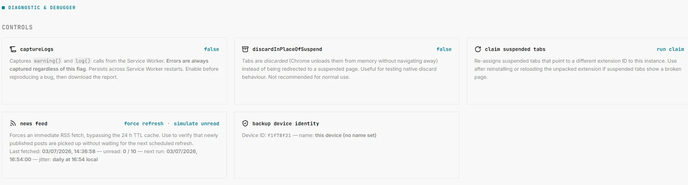

# Diagnostic page

Open the Diagnostic page from the **Debugging** link at the bottom of [About & Support](./about-support) (`debug.html`). It is not linked from the main sidebar — it's an advanced/support-oriented page, most useful when reporting a bug.

:::tip
For everyday tab issues (broken favicons, Tab Groups after a restart), try [Tab Health](./tab-health) first — it has one-click fixes. Use the Diagnostic page when you need raw logs or lower-level state to attach to a bug report.
:::

---

## Controls

### captureLogs
Off by default. When enabled, TMS also captures `warning()` and regular `log()` calls from the Service Worker into the persistent log buffer (errors are **always** captured regardless of this toggle). Turn this on *before* reproducing an intermittent bug, then use **Download report** once you've reproduced it. The flag persists across Service Worker restarts.

### discardInPlaceOfSuspend
Off by default, and **not recommended for normal use**. When enabled, tabs are discarded by Chrome's native mechanism instead of being redirected to TMS's suspended page. Useful only for comparing TMS's behavior against native Chrome discarding while testing.

### claim suspended tabs
Click **run claim** to re-assign any suspended tabs that currently point at a *different* extension ID back to this installation. Use this after reinstalling TMS or reloading it unpacked during development, if previously-suspended tabs show a broken page because their URL still references the old extension ID.

### news feed
Shows the last fetch time, unread/total article count, next scheduled alarm, and this device's randomized daily refresh time slot for [News](./news-feed). **force refresh** bypasses the 24-hour cache and fetches immediately — only visible on unpacked/developer builds, not on the Chrome Web Store release.

### backup device identity
Shows this browser installation's backup device ID and friendly name (see [Backup & Sync](./backup-sync#automatic-session-backup)) — useful for identifying which device a given cloud backup file belongs to. The ID is shown in monospace and can be selected/copied in one click for support purposes.

---

## Log buffer

A live, colour-coded (by severity) view of the persistent log buffer — up to 500 entries, surviving Service Worker restarts.

| Button | Effect |
|---|---|
| **Refresh** | Reloads the log view from storage |
| **Clear log** | Empties the buffer |
| **Copy report** | Copies a bundled report (TMS version, browser user-agent, tab profiler snapshot, full log buffer) to the clipboard as plain text |
| **Download report** | Saves the same bundled report as a downloadable text file |

Use **Copy report** or **Download report** when filing a [GitHub issue](https://github.com/gioxx/MarvellousSuspender/issues) — it gives maintainers a self-contained, shareable diagnostic without needing you to open DevTools yourself.

---

## Tab profiler

A live table of every currently open tab TMS is tracking, refreshed continuously: window ID, tab ID, tab index, tab group, title, remaining time before auto-suspend (MM:SS), and current status. Useful for confirming *why* a specific tab isn't being suspended when you expect it to be — cross-reference the status column against [Settings → Suspend](./settings#suspend) and the [popup's status descriptions](./quick-actions-popup#status-line).
