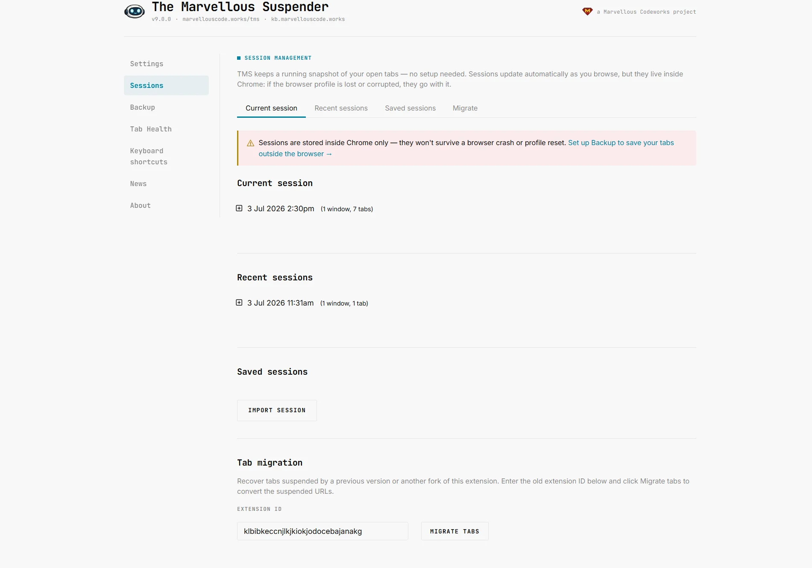
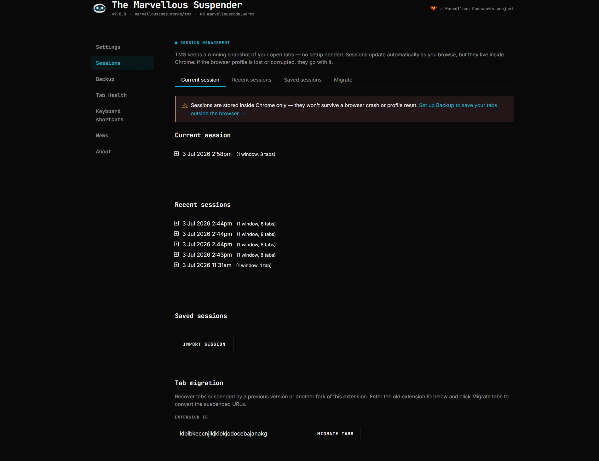

# Session management

Open the Session Management page from the extension popup (**Session Manager**) or from **Session Management** in the left sidebar (shown on every extension page). Not available in Incognito windows.

The page is organized into four sections, each reachable from the in-page navigation at the top: **Current session**, **Recent sessions**, **Saved sessions**, and **Migrate**.

*Dark theme:*

:::note
This page is TMS's built-in, always-on session history, it works even if you never touch the automatic [Backup & Sync](./backup-sync) feature. Think of Session Management as "what TMS already remembers about your tabs" and Backup & Sync as "an extra copy saved outside the browser."
:::

---

## How TMS records sessions

Every time your browser windows or tabs change, TMS keeps an up-to-date record of all open windows and tabs (including suspended ones, tab groups, and pinned state) in a local IndexedDB database. This happens automatically in the background, there is nothing to configure.

Three kinds of session records exist:

| Kind | What it is | Where it appears |
|---|---|---|
| **Current session** | A live, continuously-updated snapshot of your open windows right now | Current session section |
| **Recovery sessions** | Automatic restore points, created at key moments (browser start, extension update) so you can recover if something goes wrong | Recent sessions section |
| **Saved sessions** | Snapshots you explicitly named and saved, kept indefinitely until you delete them | Saved sessions section |

---

## Current session

Shows your live session: every open window and its tabs, expandable to see individual tab entries with title, favicon and URL. Suspended tabs are shown with their original URL, not the internal `chrome-extension://…` suspended-page URL.

Each session/window has an action row:

| Action | Effect |
|---|---|
| **Reload** | Re-opens every tab in the (session or window) in its normal, unsuspended state |
| **Resuspend** | Re-opens every tab already suspended, much faster than a full reload if the session has many tabs |
| **Export** | Downloads the session (or a single window) as a `tms-session-YYYY-MM-DD.json` file |
| **Save** | Prompts for a name and copies the session into **Saved sessions** |
| **Delete** (session only) | Removes the whole session record from history, after a confirmation prompt |

Within an expanded session you can also remove individual tabs from the record with the tab-level **remove** link, this only edits the history entry, it does not close the real browser tab.

:::tip
Reload/Resuspend/Export/Save are only available on windows other than the one you are currently viewing the Session Management page from, this prevents you from resuspending the tab you're currently reading.
:::

---

## Recent sessions

Automatic restore points that TMS creates on its own, most recent first. Use these to recover tabs after:
- A browser restart or crash
- Removing/reinstalling the extension without unsuspending tabs first
- An accidental "close window"

Each entry behaves exactly like a current session (expand, Reload, Resuspend, Export, Save, Delete), the only difference is *how* it was created.

See also: [Recovering lost tabs](../tgs-recover-lost-tabs) for a deeper recovery walkthrough, including how to search `chrome://history` if a tab isn't in any recorded session.

---

## Saved sessions

Sessions you have explicitly saved by name, kept until you delete them. Use this as a manual bookmark for a set of tabs you want to reopen later ("Research, Project X", "Weekend reading", etc.).

### Import a session file
Click **Import session** to load a `.json` file previously exported from TMS (or from The Great Suspender). You will be prompted for a name; if a saved session with that name already exists, TMS asks whether to overwrite it. TMS also accepts a legacy plain-text format, one URL per line, blank lines separating windows.

Files produced by the [Backup & Sync](./backup-sync) restore flow are also imported here automatically and show up as regular saved sessions.

### Export
Same per-session/per-window export as in Current and Recent sessions, producing a `tms-session-YYYY-MM-DD.json` file you can back up or move to another machine via **Import**.

---

## Migrate from another suspender

At the bottom of the page, the **Migrate** section detects other tab-suspender extensions with suspended tabs currently open in your browser (The Great Suspender, The Great Suspender, notrack, or The Great-*er* Tab Discarder) and pre-fills their extension ID and a tab count.

Click **Migrate tabs** to rewrite every matching suspended tab's URL so it points at TMS instead, the tabs are converted in place, without needing to unsuspend and resuspend them individually. The extension ID field also accepts a 32-character ID typed in manually if the automatic detection doesn't find your case.

:::tip
This is the primary path for a clean switch from The Great Suspender: pointing your existing suspended tabs at TMS avoids losing them the moment you disable/remove the old extension. See also: [What happened to The Great Suspender?](../faq#what-happened-to-the-great-suspender)
:::
