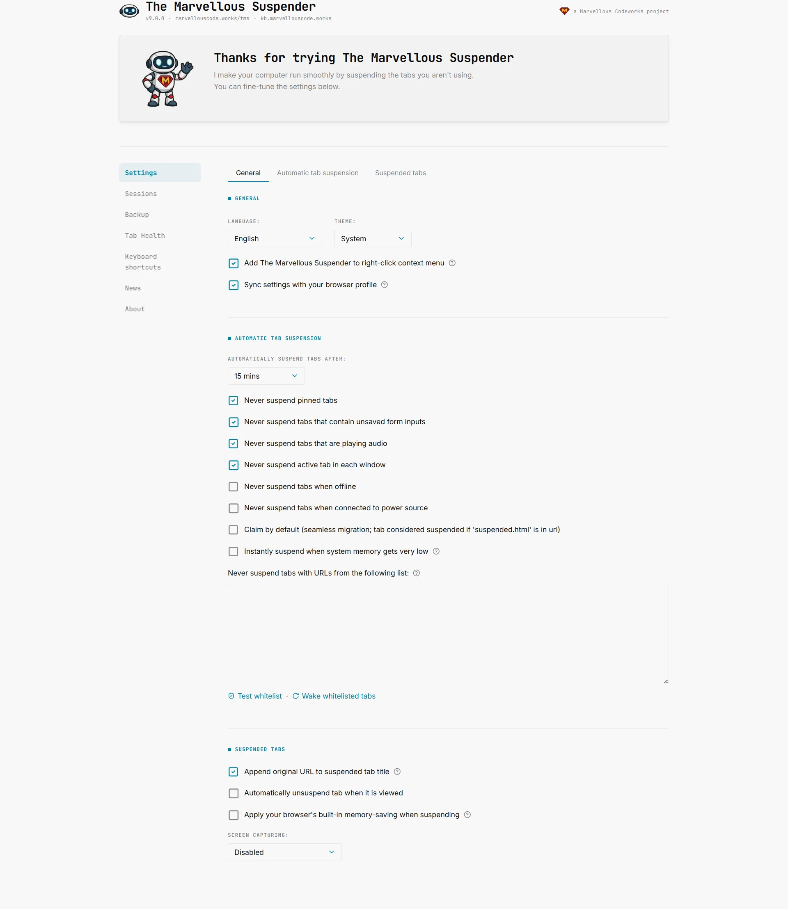
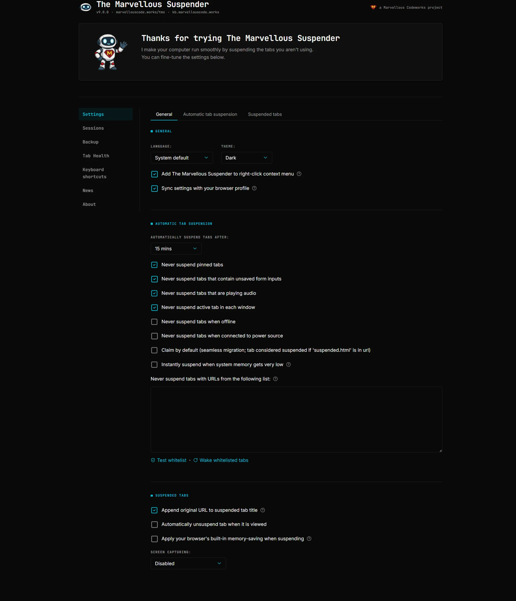

# Settings reference

Open the TMS settings page from the extension popup or by navigating to `chrome://extensions/` → TMS → **Details** → **Extension options**.

This page (`options.html`) covers general behavior, automatic suspension and the suspended-tab page. Automatic backups and session restore now live on their own dedicated pages, see [Backup & Sync](./backup-sync) and [Session Management](./session-management).

*Dark theme (also showing the Theme dropdown set to Dark):*

---

## General

### Language
Controls the language used throughout the extension UI. Set to **System** (default) to follow your browser's locale, or pick a specific language from the list.

TMS is already available in more than 15 languages, managed and kept up to date via [Crowdin](https://crowdin.com/project/tms), see the dropdown in Settings for the current full list.

### Theme
Controls the appearance of the suspended tab page.

| Value | Behavior |
|---|---|
| **System** (default) | Follows your OS light/dark preference automatically |
| **Light** | Always uses the light theme |
| **Dark** | Always uses the dark theme |

### Enable context menu
Adds TMS commands to the browser's right-click context menu on tabs. Disabled in Incognito windows.

### Sync settings across devices
Syncs your TMS configuration via your Google account using Chrome's sync storage. Useful if you use Chrome on multiple computers.

:::note
Sync has a storage size limit. If your never-suspend list is very large, sync may not work reliably. In that case, use [Backup & Sync](./backup-sync#settings-backup) instead, it can save your full settings file to a local file or to Google Drive, with no size restriction.
:::

### Enable news feed
*Added in 9.0.1.* Enabled by default. Controls whether TMS periodically checks `marvellouscode.works` for TMS-related posts and shows them on the [News](./news-feed) page. Disable this to stop the background request entirely, no fetches happen and the **News** entry disappears from the sidebar on every page until you turn it back on.

### Use the classic The Great Suspender artwork
*Added in 9.0.2.* Disabled by default. Swaps TMS's current robot mascot/icon set back to the original The Great Suspender artwork app-wide: toolbar icon, suspended-tab favicon fallback, and every extension page's images and favicon. Illustrations with no legacy equivalent keep using the new artwork.

---

## Suspend

### Suspend automatically after
How long a tab must be inactive before TMS suspends it. Options range from 20 seconds to 2 weeks. Set to **Never** to disable automatic suspension.

### Suspend tabs on battery power after
*Added in 9.0.3.* Defaults to **Same as when plugged in** (no override). Lets you suspend tabs more aggressively while running on battery than your normal AC timeout, without changing that AC timeout. Only takes effect while the device is actually unplugged; ignored while charging.

### Don't suspend pinned tabs
Pinned tabs are excluded from automatic suspension.

### Don't suspend tabs opened in app windows
*Added in 9.0.3.* Enabled by default. Covers both a page opened via Chrome's **Create Shortcut → Open as window** (or the browser menu's **Install page as App**) and an installed PWA (**Install `<site>`** from the address bar), each opening in its own dedicated window rather than a normal tab. Deliberately does not extend to ordinary popup windows a site opens itself. A manual "suspend this tab now" still works regardless, only automatic suspension respects this setting.

### Don't suspend tabs with unsaved form data
TMS detects whether a tab contains an active form with unsaved input and skips it. Useful for forms that don't auto-save.

### Don't suspend tabs playing audio
Tabs that are currently playing audio (music, video, calls) are excluded.

### Don't suspend the active tab in each window
The currently focused tab in every open window is never suspended automatically.

### Only suspend when connected to the internet
TMS will not suspend tabs when the browser detects no network connection.

### Only suspend when on battery power
Suspension only happens when the device is running on battery, not when plugged in.

### Claim suspended tabs by default
When TMS is updated or reloaded, it automatically takes ownership of any already-suspended tabs it finds. Disable this if you manage multiple suspender extensions and want explicit control.

### Suspend in place of discard (low memory)
When Chrome is about to discard a tab due to memory pressure, TMS intercepts the action and suspends the tab instead (preserving the URL on a TMS page). Discarded tabs are harder to recover than suspended ones.

### Never-suspend list
A list of URL patterns that TMS will never suspend automatically, labeled on the page as "Never suspend tabs with URLs from the following list". Referred to as the **allowlist** throughout the UI since 9.0.2 (this was a copy-only rename, the storage key and internal code are unchanged). One pattern per line. Supports:
- Full URLs: `https://mail.google.com`
- Domain patterns: `google.com` (matches all pages on that domain)
- Regular expressions: `/^https:.*google\.com/`

Use the test link below the text area to check whether a given URL would be matched, and **Wake matching tabs now** to immediately unsuspend any currently-suspended tab in the window that matches an entry you just added.

### Always suspend list
*Added in 9.0.2.* A second list, right next to the allowlist, labeled "Always suspend tabs with URLs from the following list". Tabs matching it always suspend after the normal timeout, bypassing the pinned/audible/unsaved-form-input protections that would otherwise keep them open indefinitely, useful for something like a background Twitch or YouTube tab left playing audio that you still want suspended on schedule. Manual per-tab pauses and global protections (offline, charging, "never suspend") are still respected, this only overrides the passive automatic ones.

Same matching rules as the allowlist above (plain text or `/regex/`). Comes with its own **Suspend matching tabs now** button, mirroring the allowlist's wake button, to immediately suspend any open tab that matches an entry you just added instead of waiting for the normal timeout.

---

## Suspended Tabs

### Append original URL to suspended tab title
Enabled by default. Appends the original page URL to the browser tab's underlying `document.title` (not the visible text on the suspended page itself) so that Chrome's **Search Tabs** feature (`Ctrl+Shift+A`) can find a suspended tab by typing its hostname, not just its page title.

### Unsuspend automatically when tab is focused
When you switch to a suspended tab, TMS immediately starts loading it without requiring you to click. Convenient if you switch tabs frequently and want seamless restoration.

### Discard tab after suspending
After TMS suspends a tab (converting it to the TMS suspended page), it also tells Chrome to discard the tab from memory. This achieves maximum memory savings but means Chrome must reload the TMS page itself when you switch back to the tab.

### Screen capture on suspended tab page
Controls whether TMS takes a screenshot of the page before suspending it, which is then shown as a preview on the suspended tab page.

| Value | Behavior |
|---|---|
| **Disabled** | No preview image |
| **Visible screen only** | Captures what is currently visible in the viewport |
| **Entire page** | Scrolls and captures the full page content |

### Force screen capture even for tabs with restricted content
By default, TMS skips screen capture for pages that block it (e.g., via CSP or Chrome's internal pages). Enable this to attempt capture anyway. Note: some pages will still produce a blank image.

### Preserve YouTube playback position when suspending
Saves your current playback timestamp before suspending a YouTube tab and resumes from there on unsuspend, instead of restarting the video from the beginning.

### Always reopen suspended tabs scrolled to the top
*Added in 9.0.3.* Disabled by default. Skips restoring the saved scroll position on unsuspend, the tab always reopens at the top of the page instead. Applies to both automatic and manual suspension, and overrides any `#section` link anchor in the URL.

### Reload also unsuspends tabs in the background
*Added in 9.0.3.* Disabled by default. Normally, reloading a suspended tab only counts as an explicit "unsuspend" request when that tab is the one currently focused. Enable this to also recognize a reload on a suspended tab you're not currently looking at (e.g. via a multi-tab selection, or right-click → Reload on an inactive tab) as an unsuspend request.
