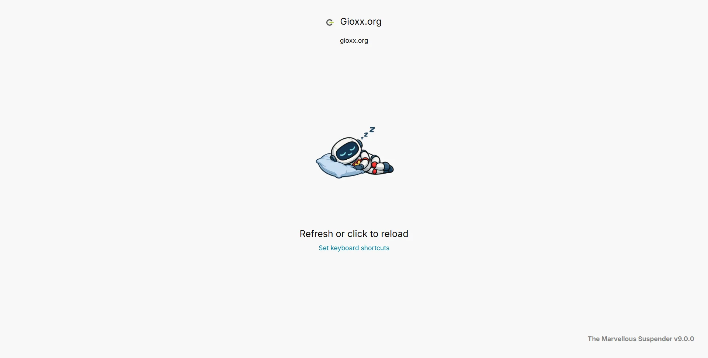
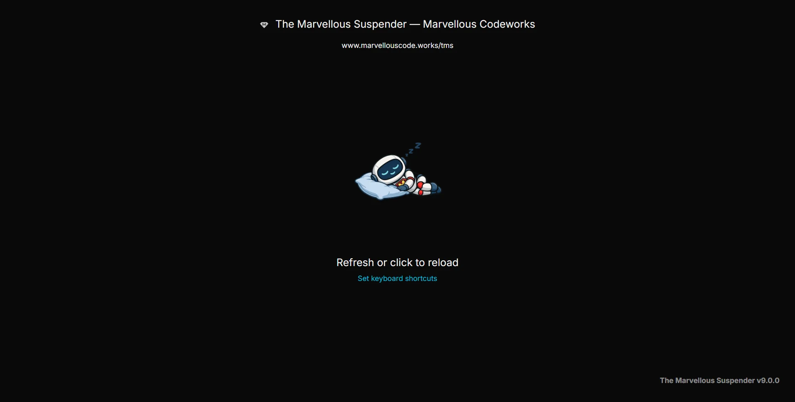
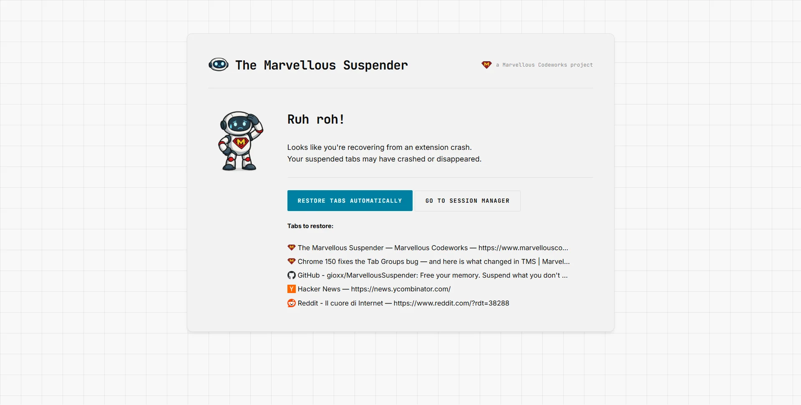
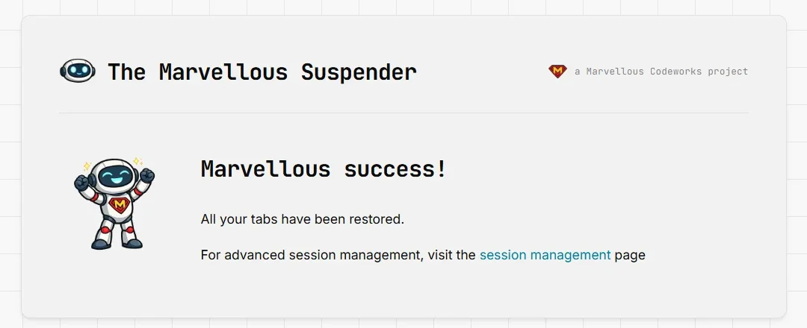

# System & recovery pages

Besides the extension's main pages (Settings, Session Management, Backup & Sync, Tab Health, News, About), TMS opens a handful of small, single-purpose pages automatically at specific moments, after an update, after a crash, or when a permission is missing. This page explains what each one is and what to do when you see it.

---

## The suspended tab page

The page shown in place of every tab TMS suspends (`suspended.html`). It shows the site's favicon and title, the original URL, and a hint on how to reload it (click anywhere, or use the tab-toggle [keyboard shortcut](./keyboard-shortcuts)). Its appearance (light/dark, screenshot preview) is controlled from [Settings → Suspended Tabs](./settings#suspended-tabs).

*Dark theme:*

If you see **"This site cannot be reached"** on what should be a suspended tab, see [My suspended tab says "This site cannot be reached"](../troubleshooting/tgs-recover-lost-tabs#my-suspended-tab-says-this-site-cannot-be-reached).

## Update screens

When TMS updates itself:

- **Pre-update backup prompt** (`update.html`), shown *before* the update is applied, if TMS believes tabs might be at risk. It offers **Export backup** (saves the current session as a `.json` file, same as [Session Management → Export](./session-management#export)) and confirms that a recovery restore point was also created automatically, viewable afterwards from [Session Management → Recent sessions](./session-management#recent-sessions).
- **Update in progress / completed** (`updated.html`), shown *after* the update finishes. While tabs are being restored it shows a progress state; once done, it confirms success and links to Session Management for anything that needs manual attention. For major version updates it may show extra release-specific notes.

You do not need to act on either screen unless something looks wrong, both are informational.

## Recovery screen

`recovery.html` appears if TMS detects that not all previously-open tabs came back after a browser restart or crash. It lists the tabs it believes are missing and offers:

- **Restore tabs automatically**: reopens the listed tabs for you
- **Manage manually**: jumps to [Session Management](./session-management) so you can pick specific windows/tabs yourself instead

Once restoration finishes, a success screen confirms all tabs were restored:

If [screen capture](./settings#screen-capture-on-suspended-tab-page) is enabled, a notice on this screen offers a quick link to disable it, screenshots are the most expensive part of a suspend/restore cycle on very large sessions, so switching it off here can speed up recovery on future restarts.

## Restoring-window screen

`restoring-window.html` is a brief, no-interaction placeholder shown for a moment while TMS restores an entire window from a saved or recovered session (see [Session Management → Reload/Resuspend](./session-management#current-session)). It replaces itself automatically once the real tabs finish loading.

## "Broken" page

`broken.html` appears if TMS's Service Worker cannot start correctly for a given tab (e.g. right after a manual reload of the unpacked extension during development, or a rare corrupted-state case). It offers a **Restart extension** button and a link to Session Management in case tabs need manual recovery, plus a shortcut to file a [GitHub issue](https://github.com/gioxx/MarvellousSuspender/issues) if it keeps happening.

## Local file permissions page

`permissions.html` is what opens when TMS needs to read a `file://` URL but Chrome hasn't granted it access, reached via the popup's **Grant permission** link (see [Toolbar popup → Local file permissions](./quick-actions-popup#local-file-permissions)). It offers:
- **Export current session**: a safety-net backup before you change extension permissions
- **Set file permissions**: opens `chrome://extensions/?id=<TMS's ID>`, where you can toggle **Allow access to file URLs** yourself (Chrome does not allow extensions to grant this permission programmatically).
