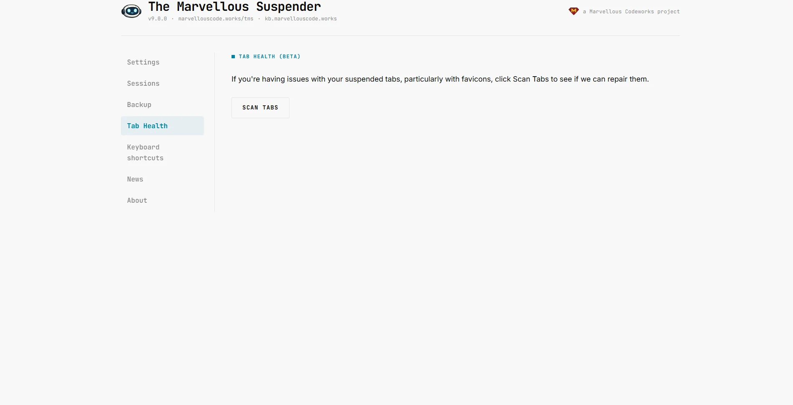
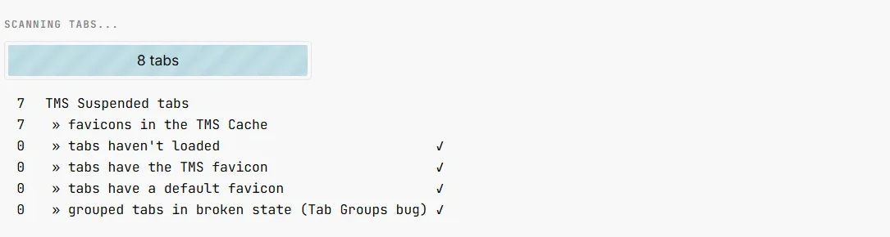
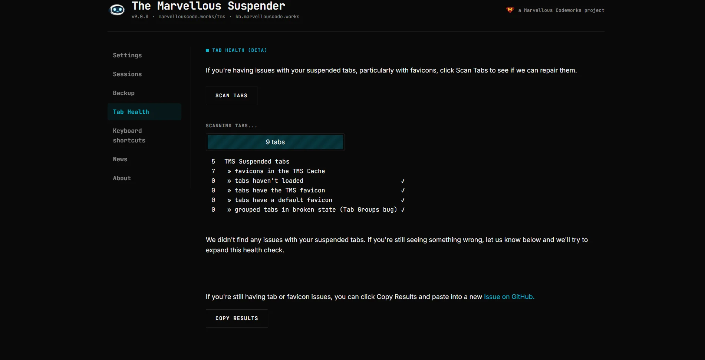
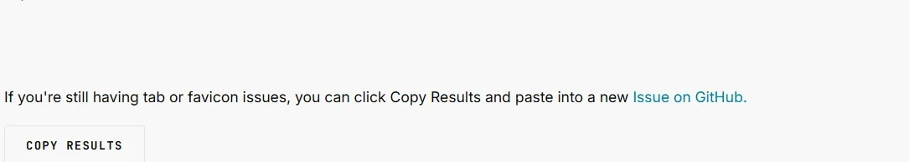

# Tab Health

Open the Tab Health page from the extension popup or from **Tab Health** in the left sidebar (shown on every extension page). Available in Incognito windows too.

Tab Health is a self-service diagnostic tool: it scans all of your currently open tabs, reports on the state of TMS's suspended tabs, and — when it finds something fixable — offers a one-click repair action.

---

## Running a scan

Click **Scan tabs**. TMS inspects every open tab across every window and reports:

| Metric | Meaning |
|---|---|
| Suspended tabs | Total tabs currently suspended by TMS |
| » Favicon cache entries | Size of TMS's internal favicon cache (IndexedDB) |
| » Empty favicon | Suspended tabs with no favicon at all |
| » Extension favicon | Suspended tabs still showing TMS's own icon instead of the site's |
| » Default/generic favicon | Suspended tabs showing Chrome's generic page icon instead of the site's real one |
| » Broken Tab Groups | Grouped tabs affected by the Chrome/Brave restart bug (see below) |

A ✓ next to a row means that category found nothing wrong.

*Dark theme:*

---

## Repair actions

If the scan finds an issue, an action button appears below the results. TMS prioritizes issues in this order — only the highest-priority fixable issue is offered at a time:

### 1. Repair grouped tab(s)
Highest priority. Detects tabs that belong to a Chrome Tab Group and were left broken after a browser restart — see [Broken Tab Groups after restart](#broken-tab-groups-after-restart) below. Clicking **Repair** re-creates each broken tab at its correct suspended URL, inside its original group, and removes the broken one.

### 2. Reload tab(s) with no favicon
Suspended tabs whose favicon never loaded (usually because the page was suspended too quickly, before Chrome had cached the icon). Clicking **Reload** re-suspends those tabs, which typically re-triggers a correct favicon fetch.

### 3. Restore tab(s) with generic favicon
Suspended tabs showing Chrome's default/generic icon instead of the site's real favicon — usually because the site's favicon couldn't be fetched at suspend time. Clicking **Restore** unsuspends the affected tab, reloads it (to let Chrome cache the real favicon), waits a moment, then re-suspends it automatically. Multiple tabs from the same hostname are batched, so only one representative tab per host needs to actually reload.

If none of the above apply, the scan reports **All good** and no action button is shown.

---

## Broken Tab Groups after restart

Chrome and Brave have had bugs (see [TMS issue #369](https://github.com/gioxx/MarvellousSuspender/issues/369) and the [dedicated blog post](https://kb.marvellouscode.works/blog/tms-tab-groups-chrome-149-bug)) that break grouped, suspended tabs when the browser restarts:

- **Chrome / Edge**: grouped suspended tabs come back marked as `discarded` and can redirect to a blank/new-tab page the first time you click them.
- **Brave**: Brave doesn't fire the events TMS normally relies on to catch this automatically, and shows the tab as a plain `chrome://newtab/` page with no way to tell which site it used to be.

Tab Health's **Repair grouped tab(s)** action fixes both cases on demand:
- For the Chrome/Edge case, the broken tab still carries its suspended URL internally, so TMS simply recreates it in place, in the same group.
- For the Brave case (where the URL is genuinely lost), TMS searches your recent [session history](./session-management#recent-sessions) for a matching tab — by comparing window order and tab position — and recovers the original suspended URL from there. If no match is found for a given tab, it is reported as **not recovered** so you know to check it manually; matched tabs are still recreated in the correct group.

:::note
For related background on lost/disappearing tabs in general (not specific to Tab Groups), see [Recovering lost tabs](../tgs-recover-lost-tabs).
:::

---

## Copying a report for a bug report

After a scan, a **Copy report** button appears. It copies your TMS version number, the full scan results, and the raw per-category counts to your clipboard as plain text — paste this directly into a [GitHub issue](https://github.com/gioxx/MarvellousSuspender/issues) so maintainers can see exactly what your scan found without you needing to describe it manually.

For deeper diagnostics (error logs, tab profiler, Service Worker state), see the [Diagnostic page](./diagnostic-page).
